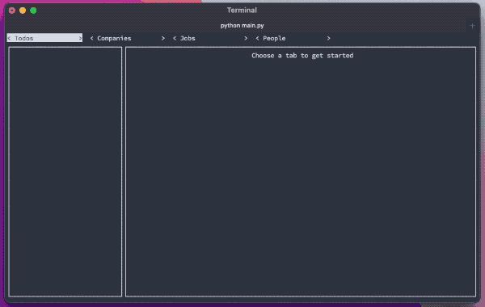

# job-search-tools
A terminal-based UI for organizing information related to a job search



## Installation
```
git clone https://github.com/colinjroberts/job-search-tools.git
cd job-search-tools
pip install requirements.txt
python main.py
```

If you want to try out the tool with fake data, uncomment line 73 in main.py
the before you first run the program then comment it out again:
```
database.initialize_db(self.conn)
```

To quit, press `q` when not in a text prompt.

## About
This is a terminal-based UI for keeping track of data related to a job search. 
It allows one to keep track of companies; jobs and people connected to those 
companies; notes about those companies, jobs, and people; and unrelated todos. 
All navigation can be performed from the keyboard, and some can be performed 
with mouse clicks.

I built this to help myself do the following better than I could with a 
spreadsheet:
- Keep track of companies I am interested in and current openings.
- Keep track of where I am in the application process for each job (and hide 
  jobs that I've been rejected from).
- Keep track of people I've spoken to related to jobs or companies.
- Keep track of notes related to jobs, companies, and people.


### Adding a Todo
Todos can be added and deleted without affecting other objects

### Adding a Company
A company is the first thing that needs to be added. From the new company, one
can add jobs and people.

### Adding a Job
Jobs can be accessed from the Jobs tab or by selecting a job from a company.

### Adding a Person
People can be accessed from the People tab or by selecting a job from a company.


### Adding Notes


### Deleting
This tool cascades deletes. Deleting an object will delete that object and all 
other objects that are only associated  with it. For example, if a company has 
a few jobs associated with it, deleting the company will delete all of those 
associated jobs. Objects like notes can be connected to a company, a job, and a 
person. If a note is associated with multiple objects, when one of those objects
is deleted, the note becomes disassociated with it. When a note has only one 
object and that object is deleted, the note is also deleted. 


## General Goals
- Track companies I am interested in
  - Company name, jobs website, people I may want to talk to, notes about 
    products and languages, company's goals/mission, etc. 
  - Track who I've talked to and when 
  - Periodically scrape for new jobs and alert me when something is available I 
    might like
- Track jobs I'm interested in and steps in application process:
  - Job title and description (perhaps parsed from website)
  - Track when I applied and how, how far I got in the process, what decisions 
    were made.
- Generate somewhat tailored cover letters and resumes. 
  - For each job entry I have, write about my accomplishments in a number of 
    different ways
  - Then when I need a resume or cover letter, generate it based on the tags for
    the role.
  


## Future Ideas:
- Add delete note button
- On delete, have popup that says how many items will end up being deleted
- Refactor to dedupe build methods, on_etc buttons
- Refactor perhaps making each view into a class that has its own properties?
- Add a job scraper that can use a company's website and some keywords to p
  resent prospective jobs, 
  open them in a browser, and allow adding them quickly or dismissing them.